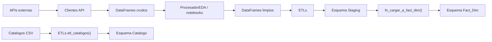
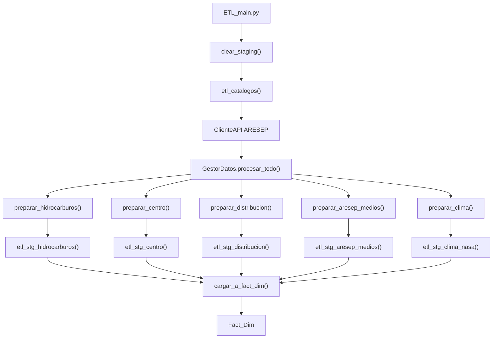
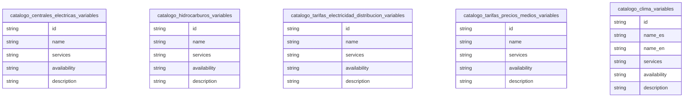
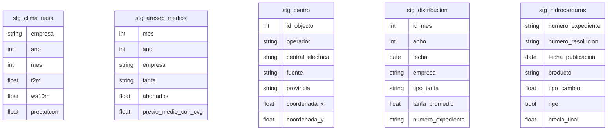
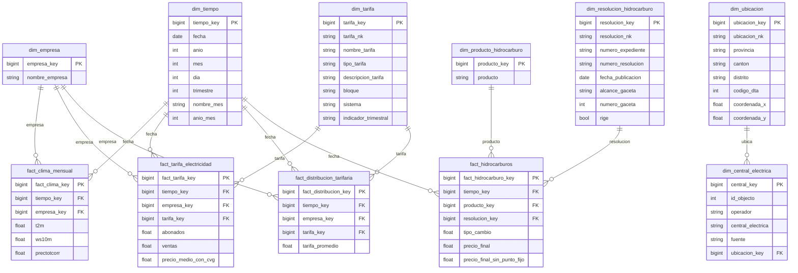

# Prediccion Consumo Energia Costa Rica

Proyecto de integracion, limpieza y modelado de datos energeticos de Costa Rica.  
El repositorio concentra:

- extraccion desde APIs de NASA POWER y ARESEP
- limpieza exploratoria reproducida en notebooks
- carga a un Data Warehouse en PostgreSQL
- construccion de esquemas `Catalogo`, `Staging` y `Fact_Dim`

## Vision general



## Objetivo del proyecto

El flujo principal toma fuentes de tarifas electricas, clima, centrales electricas e hidrocarburos, las normaliza a un formato comun con pandas y luego las carga a PostgreSQL para construir un modelo dimensional listo para analisis posterior.

## Partes del proyecto

### 1. APIs y fuentes

- `src/api/cliente_api_clima.py`
  Consulta NASA POWER y genera el historico mensual de clima por empresa.

- `src/api/cliente_api_aresep.py`
  Consulta ARESEP y construye DataFrames para:
  - distribucion electrica
  - precios medios
  - centrales electricas
  - hidrocarburos

### 2. Limpieza y unificacion

- `src/eda/ProcesadorEDA.py`
  Aplica conversiones, limpieza, validaciones, deteccion de nulos, outliers y transformaciones de coordenadas.

- `src/datos/gestor_datos_aresep_clima.py`
  Une los CSV historicos de ARESEP y el archivo de clima NASA para construir:
  - `aresep_unificado_2020_2025.csv`
  - `dataset_final_2020_2025.csv`

- `notebooks/`
  Contiene los flujos exploratorios usados para llegar a los CSV de referencia y validar la limpieza por dominio.

### 3. Carga al Data Warehouse

- `src/datos/CargadorDatos.py`
  Clase base que mantiene `self.df`, exporta CSV, consulta SQL y ejecuta la carga final del DW.

- `src/datos/ETLs.py`
  Carga DataFrames limpios al esquema `Staging` y los catalogos CSV al esquema `Catalogo`.

- `src/datos/DataModels/`
  Define los modelos de fila usados para traducir columnas de pandas al naming SQL del staging.

- `src/datos/GestorDBconn.py`
  Administra la conexion PostgreSQL y la ejecucion de SQL/funciones almacenadas.

### 4. Scripts SQL

- `src/base_datos/Esquema_Catalogos.sql`
  Crea las tablas de diccionario de variables.

- `src/base_datos/Esquema_Staging.sql`
  Crea las tablas temporales de carga.

- `src/base_datos/Esquema_Fact_Dim.sql`
  Crea dimensiones y hechos del DW.

- `src/base_datos/Funciones_Staging.sql`
  Define funciones de insercion por fila al staging.

- `src/base_datos/Funciones_Fact_Dim.sql`
  Define la funcion que puebla dimensiones y hechos desde staging.

## Clases principales y como funcionan

### `CargadorDatos`

Clase base del flujo de datos.  
Responsabilidades:

- mantener el `DataFrame` activo en `self.df`
- cargar CSV o tablas SQL a pandas
- guardar DataFrames como CSV
- ejecutar `cargar_a_fact_dim()`
- soportar encadenamiento con `chain=True`

Uso conceptual:

```python
from src.datos.CargadorDatos import CargadorDatos

cargador = CargadorDatos()
cargador.csv_to_df("ruta.csv")
```

### `ProcesadorEDA`

Hereda de `CargadorDatos` y opera sobre el mismo `self.df`.  
Responsabilidades:

- eliminar columnas y nulos
- convertir tipos
- revisar consistencia
- detectar nulos, ceros y outliers
- transformar coordenadas proyectadas a longitud/latitud

Uso conceptual:

```python
from src.eda.ProcesadorEDA import ProcesadorEDA

eda = ProcesadorEDA()
eda.csv_to_df("archivo.csv").rm_col(["observaciones"]).ceros_nan(to_cero=True)
```

### `GestorDBconn`

Encapsula la conexion PostgreSQL.  
Responsabilidades:

- abrir la conexion bajo demanda
- ejecutar SQL directo
- consultar resultados como `DataFrame`
- invocar funciones SQL del proyecto

### `ETLs`

Hereda de `ProcesadorEDA`, por lo que puede limpiar y cargar usando la misma instancia.  
Responsabilidades:

- poblar `Staging` por dominio
- limpiar staging
- poblar `Catalogo` desde CSV

Cada metodo `etl_stg_*`:

1. valida que exista `self.df`
2. convierte cada fila a un `DataModel`
3. serializa los valores al orden del staging
4. inserta por lotes en PostgreSQL
5. si un lote falla, baja a modo diagnostico fila por fila

### `DataModels`

Los archivos `StgClimaNasa.py`, `StgAresepMedios.py`, `StgCentro.py`, `StgDistribucion.py` y `StgHidrocarburos.py` representan una fila canonica de cada tabla staging.

La base comun es `_BaseStgModel.py`, que:

- traduce nombres de columnas usando `aliases`
- convierte `NaN` a `None`
- convierte `Timestamp` a `date`
- normaliza booleanos como `True`, `False` o `NULL`
- devuelve parametros en el orden correcto para SQL

## Flujo operativo desde la ingesta hasta el DW

### Flujo ETL principal

El script principal es:

- `src/ETL_main.py`

Secuencia resumida:

1. limpia staging
2. carga catalogos
3. extrae datos crudos desde ARESEP
4. construye datasets derivados de clima y medios
5. prepara y limpia cada dominio segun el flujo de notebooks
6. carga cada dominio a su tabla staging
7. ejecuta `cargar_a_fact_dim()` para poblar dimensiones y hechos



### Flujo de limpieza reproducido desde notebooks

Los notebooks sirven como referencia funcional del tratamiento previo al staging:

- `EDA_HC.ipynb`
  elimina columnas auxiliares, convierte nulos numericos y deja el layout limpio de hidrocarburos

- `EDA_Dist.ipynb`
  identifica columnas utiles sin nulos y valida la estructura de distribucion

- `EDA_Centrales.ipynb`
  revisa el catalogo geografico y transforma coordenadas

- `EDA_Medios.ipynb`
  revisa precios medios y su consistencia mensual

- `EDA_Clima.ipynb`
  valida las variables climaticas obtenidas desde NASA POWER

## Estructura de carpetas

```text
Prediccion_Consumo_Energia_Costa_Rica/
|-- README.md
|-- LICENSE
|-- data/
|   |-- docs_apis/
|   |   |-- aresep_*.csv
|   |   `-- nasa_power_parameters_name_es.csv
|   |-- raw/
|   |   |-- api/
|   |   `-- aresep/
|   `-- processed/
|       |-- aresep_apis/
|       |-- aresep_unificado_2020_2025.csv
|       `-- dataset_final_2020_2025.csv
|-- notebooks/
|   |-- EDA_Centrales.ipynb
|   |-- EDA_Clima.ipynb
|   |-- EDA_Dist.ipynb
|   |-- EDA_HC.ipynb
|   `-- EDA_Medios.ipynb
`-- src/
    |-- ETL_main.py
    |-- main.py
    |-- api/
    |   |-- cliente_api_aresep.py
    |   `-- cliente_api_clima.py
    |-- base_datos/
    |   |-- DW_ConsumoElect_Model.sql
    |   |-- Esquema_Catalogos.sql
    |   |-- Esquema_Staging.sql
    |   |-- Esquema_Fact_Dim.sql
    |   |-- Funciones_Staging.sql
    |   `-- Funciones_Fact_Dim.sql
    |-- datos/
    |   |-- CargadorDatos.py
    |   |-- ETLs.py
    |   |-- GestorDBconn.py
    |   |-- gestor_datos_aresep_clima.py
    |   `-- DataModels/
    |       |-- _BaseStgModel.py
    |       |-- StgClimaNasa.py
    |       |-- StgAresepMedios.py
    |       |-- StgCentro.py
    |       |-- StgDistribucion.py
    |       `-- StgHidrocarburos.py
    `-- eda/
        `-- ProcesadorEDA.py
```

## Diagramas del Data Warehouse

### Esquema `Catalogo`

Los catalogos funcionan como diccionarios independientes de variables y parametros.



### Esquema `Staging`

El staging conserva la forma operativa de cada fuente antes de transformarla al modelo dimensional.



### Esquema `Fact_Dim`

Este es el modelo dimensional final consumido por consultas y analisis.



## Scripts principales

### `src/ETL_main.py`

Script operativo principal.  
Recomendado para poblar:

- `Catalogo`
- `Staging`
- `Fact_Dim`

### `src/main.py`

Script de apoyo para generar y validar artefactos CSV locales del flujo clima + ARESEP.

## Variables de entorno para la BD

El proyecto esta pensado para no fijar credenciales en el codigo productivo.  
Las conexiones pueden resolverse con variables de entorno como:

- `PGDATABASE`
- `PGUSER`
- `PGPASSWORD`
- `PGHOST`
- `PGPORT`

## Orden recomendado de despliegue SQL

1. `Esquema_Catalogos.sql`
2. `Esquema_Staging.sql`
3. `Funciones_Staging.sql`
4. `Esquema_Fact_Dim.sql`
5. `Funciones_Fact_Dim.sql`

## Resumen

La arquitectura del proyecto va de la siguente manera:

- las APIs construyen DataFrames crudos
- `ProcesadorEDA` y los notebooks los limpian
- `ETLs` inserta catálogos y staging
- `CargadorDatos.cargar_a_fact_dim()` transforma staging en un modelo dimensional

Con esto se prepara el repositorio tanto para exploracion en notebooks como para una corrida ETL completa hacia PostgreSQL.
